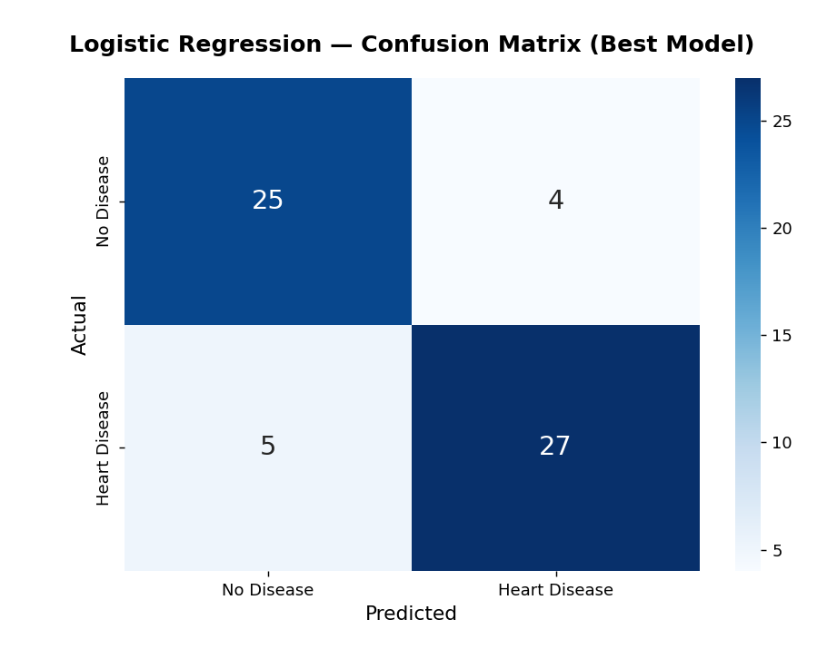

# Heart Disease Risk Prediction

A supervised machine learning model that predicts a patient's risk of heart disease from clinical measurements, framed as a case study for a fictional healthcare provider ("Peterside Hospital") built for portfolio purposes — **not** for real clinical use.



## Key Findings

- **85.2% accuracy** and **85.3% AUC-ROC** on held-out test data with the best-performing model (Logistic Regression), compared across 5 classifiers (Logistic Regression, Random Forest, XGBoost, KNN, SGD).
- **84.4% recall** — correctly flagged 27 of 32 at-risk patients in the test set, with a particular focus on minimizing missed diagnoses (false negatives).
- Full EDA, feature engineering, and model comparison (accuracy, precision, recall, F1, AUC-ROC) across all 5 classifiers are documented in the notebook.

## Project Overview

Using the classic UCI Heart Disease dataset (303 patients, 14 clinical features — demographics, chest pain type, resting ECG, max heart rate, ST depression, number of major vessels, etc.), the project builds and compares several classifiers to flag patients at elevated risk of heart disease, with a particular focus on minimizing false negatives (missed at-risk patients).

## Methodology

1. **Exploratory data analysis** — univariate, bivariate, and multivariate analysis of clinical features against the target label.
2. **Feature engineering & preprocessing** — scaling and preparing features for modeling.
3. **Model comparison** — Logistic Regression, Random Forest, XGBoost, K-Nearest Neighbors, and SGD classifiers, evaluated on accuracy, precision, recall, F1, and AUC-ROC.
4. **Model selection** — the best-performing model (Logistic Regression) is reported below.

## Tech Stack

- Python
- pandas, NumPy
- scikit-learn, XGBoost
- Matplotlib, Seaborn

## Repository Structure

```
.
├── Peterside Hospital - Heart Disease Predictions.ipynb # Full analysis: EDA → modeling → evaluation
├── heart_disease_confusion_matrix.png                   # Confusion matrix used in this README
└── README.md
```

## Getting Started

The notebook expects a `Heart.csv` file (the UCI Heart Disease dataset) in the same folder. **That file isn't included in this repo** — add it before running, e.g. from the [UCI Heart Disease dataset](https://archive.ics.uci.edu/dataset/45/heart+disease) or a Kaggle mirror.

```bash
pip install pandas numpy matplotlib seaborn scikit-learn xgboost
jupyter notebook "Peterside Hospital - Heart Disease Predictions.ipynb"
```

## Results

Best model (Logistic Regression):

| Metric | Score |
|---|---|
| Accuracy | 85.2% |
| Precision | 87.1% |
| Recall | 84.4% |
| F1-Score | 85.7% |
| AUC-ROC | 85.3% |

Full model comparison and confusion matrices are in the notebook.

## Disclaimer

This is an educational/portfolio project using a public, de-identified dataset. It is not a validated medical device and should not be used for real clinical decision-making.

## Author

**Ezekiel Ebuetse** — [GitHub](https://github.com/datawithezekiel) · [LinkedIn](https://linkedin.com/in/ezekiel-ebuetse) · [Portfolio](https://ezekielebuetse.com)
